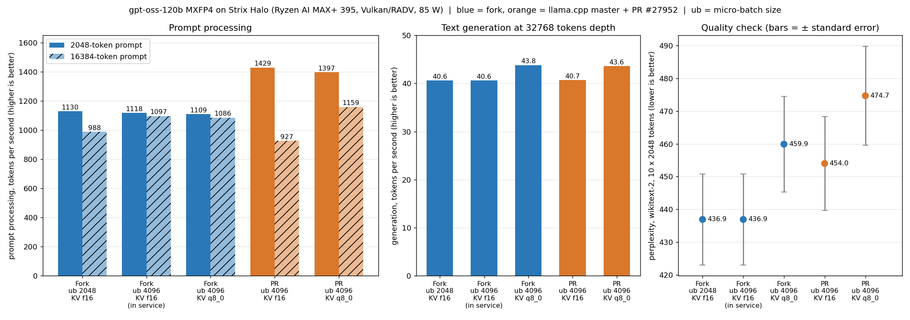

# gpt-oss-120b on Strix Halo: which settings actually matter

A side measurement to the DeepSeek protocol in this repository, taken on 2026-09-20. Raw data
and scripts: [`messungen/2026-09-20/gptoss-sweep.log`](messungen/2026-09-20/gptoss-sweep.log),
[`gptoss-sweep.sh`](messungen/2026-09-20/gptoss-sweep.sh),
[`gptoss-ppl.log`](messungen/2026-09-20/gptoss-ppl.log). (The rest of this repository is in
German; this file is in English on purpose.)

| | |
|---|---|
| Machine | AMD Ryzen AI MAX+ 395, Radeon 8060S (gfx1151), 128 GB LPDDR5X-8000 unified |
| System | Nobara 44, kernel 7.2.6, Mesa RADV (system), GTT limit 120 GiB |
| Model | `ggml-org/gpt-oss-120b-GGUF`, `gpt-oss-120b-MXFP4.gguf`, 63.4 GB, 116.8 B parameters, 128 experts, 4 active |
| llama.cpp | fork `Nathanw1014/llama.cpp` @ `50c271f8e` (upstream base 2026-08-17), built from source; upstream `a894dae` for HIP |
| ROCm | 7.1.1 (Fedora packages); additionally the 7.2.1 runtime from the Ollama bundle |
| Power mode | presumably "Balanced" 85 W — not checked separately |

All values come from `llama-bench` (`-r 2`) unless stated otherwise. The baseline is Vulkan
with `-fa 1 -b 2048 -ub 512`: **834.9 tok/s prompt processing (pp512), 53.5 tok/s text
generation (tg128)**. Load time from the page cache was 5 s; a true cold start from disk was
not measured.

## The result in one sentence

The biggest lever is the micro-batch (`-ub 2048`: +33.5 % prompt processing), text generation
sits at 85 % of the memory-bandwidth ceiling and cannot be raised meaningfully by settings,
and the EAGLE3 draft model shipped with the model makes it slower.

## What helps

| Lever | Prompt processing | Text generation |
|---|---|---|
| **Micro-batch `-ub 2048` instead of 512** (pp2048) | **+33.5 %** (838.2 → 1119.4 tok/s) | unaffected |
| Micro-batch 1024 instead of 512 | +17.8 % (987.6 tok/s) | unaffected |
| Micro-batch 256 instead of 512 | −21.2 % (660.3 tok/s) | unaffected |
| Flash attention on instead of off | +14.4 % (729.5 → 834.9 tok/s) | +1.9 % |
| Fork switch `GGML_VK_MMID_SMALLN` off | −12.4 % | 0 |
| Fork switch `GGML_VK_MMID_ROWLISTS` off | −6.5 % | 0 |
| Fork switch `GGML_VK_MMID_BM64` off | −4.6 % | 0 |

## What does nothing

| Lever | Prompt processing | Text generation |
|---|---|---|
| Batch `-b 2048` instead of 512 at a fixed micro-batch | −0.7 % (noise) | — |
| KV cache q8_0 instead of f16, at depth 8192 | −2.4 % | +2.1 % |
| Fork payload with bundled RADV instead of source build with system RADV | −4.2 % | +2.3 % |
| ROCm runtime 7.2.1 instead of 7.1.1 (HIP) | ±0.5 % | ±1 % |

So it is the **micro**-batch that counts, not the batch. The ROCm line needs a caveat: only
`libamdhip64`, `libhsa-runtime64` and `libamd_comgr` were swapped via `LD_PRELOAD`; rocBLAS
stayed at 7.1.1 because the bundle ships no gfx1151 kernels. A fully installed ROCm 7.2 has
therefore not been measured.

## HIP vs. Vulkan: a split decision

| | Vulkan (fork) | HIP (upstream, ROCm 7.1.1) | |
|---|---|---|---|
| pp512, `-ub 512` | 834.9 tok/s | **939.7 tok/s** | HIP +12.5 % |
| pp2048, `-ub 2048` | 1119.4 tok/s | **1230.2 tok/s** | HIP +9.9 % |
| tg128 | **53.5 tok/s** | 47.6 tok/s | Vulkan +12.4 % |

HIP wins prompt processing, Vulkan wins text generation. That is the pattern other Strix Halo
measurements show as well — and the opposite of what this repository measures for
DeepSeek-V4, where Vulkan wins both ([HIP-BEFUND.md](HIP-BEFUND.md), German). For chat, Vulkan
remains the right choice; for pure long-prompt workloads HIP is an option.

## Speculative decoding: EAGLE3 costs speed

The model repository ships an EAGLE3 draft model (0.8 GB as Q8_0). Measured in server mode
(`--spec-type draft-eagle3`), three fixed prompts with about 2000 tokens of context and 256
tokens of output, median:

| Draft length | Text generation | Acceptance rate | Mean accepted length |
|---|---|---|---|
| none | **51.7 tok/s** | — | — |
| 1 | 43.7 tok/s (−15.5 %) | 0.48 | 1.48 |
| 2 | 38.9 tok/s (−24.7 %) | 0.31 | 1.62 |
| 3 | 32.4 tok/s (−37.3 %) | 0.22 | 1.66 |
| 4 | 27.7 tok/s (−46.4 %) | 0.17 | 1.66 |

In addition, prompt processing drops by about 9 % with the draft model loaded.

**Caveat:** this was measured with German text through `/completion`, without the chat
template. gpt-oss is trained on its Harmony format; in real chat use and with English text the
acceptance rate may be higher. The loss is established for this test case only. That every
additionally verified position activates further experts in a MoE model and thereby eats the
gain is a plausible explanation, but it was not isolated here.

## Context depth

| Depth | Prompt processing | Text generation |
|---|---|---|
| 0 | 834.2 tok/s | 53.6 tok/s |
| 8192 | 747.7 tok/s (−10.4 %) | 49.1 tok/s (−8.5 %) |
| ~87,000 (one real request through the server) | 622 tok/s | 29.1 tok/s |

The last row comes from the running service: 87,045 prompt tokens in 140 s.

## Why text generation is at its limit

From the GGUF header (size per tensor derived from the data offsets):

| Part | Total | Read per token |
|---|---|---|
| Experts (MXFP4), 4 of 128 active | 61.07 GB | 1.91 GB |
| Attention matrices | 1.02 GB | 1.02 GB |
| Output matrix | 0.62 GB | 0.62 GB |
| Router and the rest | 0.05 GB | 0.05 GB |
| **Sum** | | **3.59 GB** |

At the 226 GB/s memory bandwidth measured on this machine, that gives a ceiling of
**62.9 tok/s**. The measured 53.5 tok/s is **85 %** of it. More generation speed requires
fewer bytes per token — and the experts cannot be made smaller with the usual GGUF formats:
all common quantizations of this model are practically the same size because the experts stay
MXFP4.

## Correctness

The parameter sweep itself ran **without** a correctness check. It was done afterwards for the
production setting (`-ub 2048`, flash attention on), across two independent implementations:

| Backend | Perplexity (wikitext, 10 chunks of 2048) |
|---|---|
| Vulkan, fork `50c271f8e` (ggml 0.20.1) | 436.9 ± 13.9 |
| HIP, upstream `a894dae` (ggml 0.24.0) | 455.5 ± 14.4 |

Both agree within one standard deviation. The high absolute value is not a compute error but
a property of the model: gpt-oss is heavily post-trained on its chat format and predicts raw
Wikipedia text poorly. **For this model, wikitext perplexity is only useful for comparing two
backends, not as a quality metric** — and at a base value of about 440 it is insensitive to
small errors. In addition, three factual questions through the real service path were all
answered correctly. The remaining table rows above (fork switches individually off, KV q8_0,
HIP with a swapped runtime) were not individually checked for correctness; how quickly that
goes wrong is shown by the retracted section in the
[README](README.md#2-zurueckgezogen-moe-kernel-verbessern-nur-den-prefill) (German), where
disabling an optimization produced a fast run that computed `nan`.

## Comparison with third-party numbers

Only pp512 with the default micro-batch is comparable: **834.9 tok/s** here versus the
third-party measurement cited in [BENCHMARKS.md](BENCHMARKS.md) at 719.9 tok/s (generation
there 56.6 versus 53.5 tok/s here). The 1119 and 1230 tok/s figures apply to a 2048-token
prompt with `-ub 2048` and must not be compared with other people's pp512 numbers — anyone
using the same setting should see a similar gain.

## Recommended setting

```bash
llama-server -m gpt-oss-120b-MXFP4.gguf -ngl 999 -fa on -ub 4096 -b 4096 --jinja \
  -c 131072 -np 2 --kv-unified --predict 16384
```

* `-ub 4096 -b 4096` and `-fa on`: the two levers with a measurable effect (`-ub 4096` adds
  another 10–11 % over `-ub 2048` on prompts of 4096 tokens and more, see the follow-up below).
* KV cache in f16, **no** draft model.
* `--kv-unified`: one shared KV buffer for both slots — a single request may use the full
  131,072 tokens. With a fixed split, a request with 86,820 tokens failed at the per-slot
  limit of 32,768. Extra cost about 2.5 GiB.
* `--predict 16384`: without a cap, a single generation ran past 20,000 tokens and would only
  have stopped at the full context.
* Memory with the model loaded: about 67 GiB. Be careful when a second large model is
  resident — on this APU the amdgpu driver hangs with ENOMEM at roughly 108 GB of used
  memory, and there is no GPU reset
  ([README, section 12](README.md#12-warnung-iq2-mit-entwurfsmodell-steht-an-der-speichergrenze), German).

## Follow-up, 2026-09-21: the remaining levers, singly and combined

Raw data and scripts in [messungen/2026-09-21/](messungen/2026-09-21/). Everything Vulkan
(RADV), 85 W power mode, MXFP4 model file, flash attention on. Three builds made on the same
day: llama.cpp master (ec9281505), master plus PR
[#27952](https://github.com/ggml-org/llama.cpp/pull/27952) (df9bcc16a), and the fork used
elsewhere in this repository (50c271f8e).

### PR #27952 (int8 cooperative-matrix kernels for RDNA3)

| Build | Prompt, 512 tokens | Prompt, 2048 tokens (`-ub 2048`) | Generation, 128 tokens |
|---|---|---|---|
| master | 783.2 tok/s | 1112.2 tok/s | 53.66 tok/s |
| fork | 847.2 tok/s | 1130.3 tok/s | 53.60 tok/s |
| **master + PR #27952** | **1151.9 tok/s (+47 %)** | **1463.9 tok/s (+32 %)** | 53.70 tok/s |

Perplexity of the PR build: 454.04 ± 14.39, against 456.47 ± 14.50 for master built the same
day (fork: 436.9) — it computes correctly. Generation is unchanged, as expected for a
bandwidth-bound phase.

### The picture flips on long prompts



| Build and setting | Prompt, 2048 tokens | Prompt, 16384 tokens | Generation at depth 32768 | Perplexity (10 chunks, lower is better) |
|---|---|---|---|---|
| fork, `-ub 2048`, KV f16 | 1130 tok/s | 988 tok/s | 40.6 tok/s | 436.9 ± 13.9 |
| **fork, `-ub 4096`, KV f16 (now in service)** | 1118 tok/s ¹ | **1097 tok/s** | 40.6 tok/s | 436.9 ± 13.9 |
| fork, `-ub 4096`, KV q8_0 | 1109 tok/s | 1086 tok/s | 43.8 tok/s | 459.9 ± 14.6 |
| PR #27952, `-ub 2048`, KV f16 | 1479 tok/s | 910 tok/s | – | 454.0 ± 14.4 |
| PR #27952, `-ub 4096`, KV f16 | 1429 tok/s | 927 tok/s | 40.7 tok/s | 454.0 ± 14.4 |
| PR #27952, `-ub 4096`, KV q8_0 | 1397 tok/s | **1159 tok/s** | 43.6 tok/s | 474.7 ± 15.1 |

¹ measured with a 4096-token prompt.

* The PR wins clearly on short prompts (+31 % at 2048 tokens) but **loses to the fork at
  16384 tokens (−17 %)** as long as the KV cache is f16. The matrix kernels are faster, but
  at that length attention over the filled cache dominates, and there the fork is ahead.
* With a q8_0 KV cache the PR build gains 25 % at 16384 tokens (927 → 1159 tok/s) while the
  fork does not move (1097 → 1086 tok/s). We have not investigated why.
* `-ub 4096` helps the fork (+10 to +11 %) and does almost nothing on the PR build.

### KV cache q8_0: faster at depth, but not free

| Context depth | Generation, KV f16 | Generation, KV q8_0 | Gain |
|---|---|---|---|
| 8192 tokens | 49.05 tok/s | 50.08 tok/s | +2.1 % |
| 32768 tokens | 40.58 tok/s | 43.75 tok/s | +7.8 % |
| 65536 tokens | 33.08 tok/s | 38.05 tok/s | +15.0 % |

Perplexity rises by about 5 % on both builds (436.9 → 459.9 and 454.0 → 474.7). Each
difference alone is inside the error bar, but the same direction and size on two independent
builds is why we count it as a real quality cost and keep f16. Caveat: wikitext perplexity of
a chat-tuned reasoning model is high and noisy to begin with (10 chunks of 2048 tokens).

### `reasoning_effort`

Six short factual and arithmetic questions against the running server. Too few for a quality
statement; the point is the waiting time.

| Setting | Correct | Tokens generated (total) | Time per question |
|---|---|---|---|
| low | 5 of 6 | 279 | 1.2 s |
| medium | 6 of 6 | 1719 | 5.8 s |
| high | 6 of 6 | 3133 | 10.3 s |

### What we took from it

Fork with `-ub 4096 -b 4096`, KV f16, `reasoning_effort` medium: +11 % on long prompts at no
quality cost. The fastest combination overall (PR #27952 + KV q8_0) would add +6 % on long
and +25 % on short prompts, at roughly 9 % higher perplexity and on an unmerged PR — not
taken for a service where correct beats fast.

## Not measured

The 120 W power mode, `amd_iommu=off`, and n-gram speculation.
