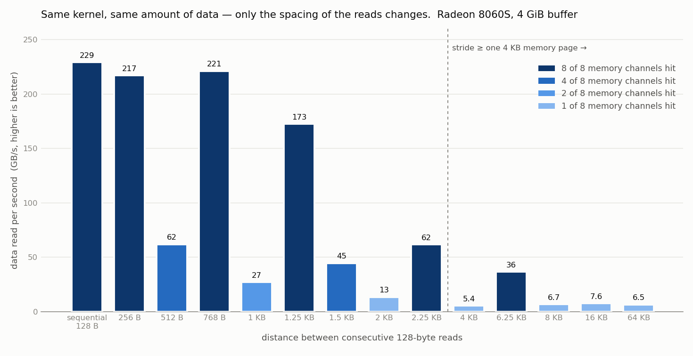
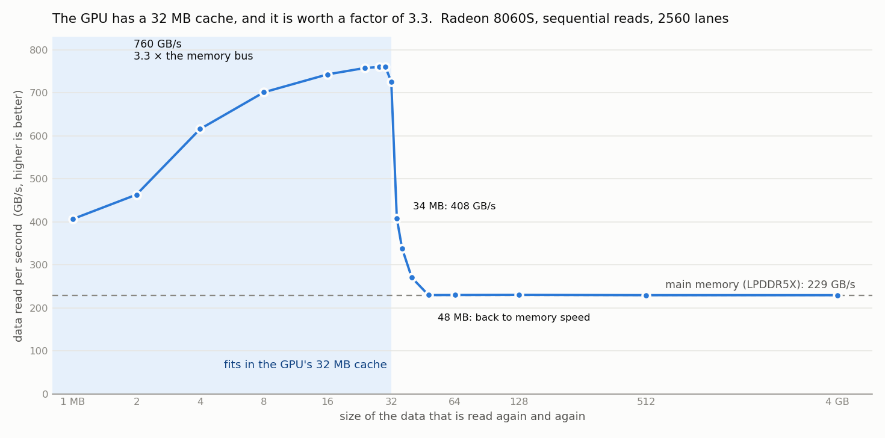

# Strix Halo: where llama.cpp's Vulkan kernels lose time, and what fixed it

Two days (2026-09-21/22) of operation-by-operation measurement of LLM inference on **GMKtec EVO-X2 — Ryzen AI MAX+ 395,
Radeon 8060S (gfx1151, 40 CUs), 128 GB LPDDR5X, BIOS 1.05, 85 W mode, Nobara 44, kernel 7.2, Mesa RADV 26.2.3**, llama.cpp
master `ec9281505` (2026-09-21). Everything below was measured on this one machine; no other GPU was available. The
analysis was done with the help of an AI coding assistant; every number was run and checked on the machine.

**Correctness rule used throughout:** a change counts only after a KL-divergence check against an independent
implementation (llama.cpp's ROCm backend) or, for pure copies/layout changes, against the same build without the change
(must be KLD 0). Three "faster" variants on the way computed garbage and were caught only by this step — `llama-bench`
never looks at the output.

## 1. The hardware, measured

| Fact | Value | How |
|---|---|---|
| memory configured | 7500 MT/s (parts rated 8532) → 240 GB/s on the 256-bit bus | `dmidecode -t 17`; GPU top memory clock 937 MHz |
| sequential GPU read | **229 GB/s = 96 % of the bus** | own Vulkan stride benchmark, unrolled ×8 |
| memory channels | channel = (address ÷ 256) mod 8 — from Mesa's `ac_gpu_info.h`, confirmed by measurement | stride sweep below |
| GPU last-level cache | **32 MB**, ≈ 760 GB/s, a sharp cliff at exactly 32 MB | working-set sweep |
| 16×16×16 matrix instruction (f16, `VK_KHR_cooperative_matrix`) | **≈ 50 TFLOPS** bare (loop unrolled; a naive probe shows 25 — its own loop overhead) | own probe |
| the same with both tiles reloaded before every second multiply | 26.5 TFLOPS | own probe |
| int8 × int8 → int32 instead of f16 | 48.0 / 25.1 TFLOPS — **no faster than f16**, also not in the loads | own probe |
| best full dense matmul | AMD rocBLAS (PyTorch, ROCm 7.13 nightly) 35–42 TFLOPS; llama.cpp Vulkan `mul_mm` 14–21 TFLOPS | |

**The channel rule is the single most useful fact here.** Bandwidth relative to sequential, by stride between the
addresses neighbouring lanes read: 512 B → 27 %, 1024 B → 12 %, 2048 B → 6 %, **4096 B → 2.4 %**. Any tensor walked with a
stride that is a multiple of 2 KB hits one or two of the eight channels. It turned up three times as the cause of a slow
kernel (sections 3 and 4, and PR #27703).

## 2. Generation is memory-bound — prompt processing is where kernels lose

gpt-oss-120b generation moves 53.7 tok/s × 3.59 GB = 193 GB/s = 84 % of the measured roof; the individual generation
kernels run at 85–97 % of it. There is little to gain in kernels; bytes per token are the lever (next paragraph). In
prompt processing the kernels are far from the roof, and all gains below are prompt gains.

**Bytes per token, measured on gpt-oss-120b** (accuracy = KL divergence against the unmodified model on the same build):

| Change | Generation | Accuracy cost |
|---|---|---|
| output head (201 088 × 2880) q8_0 → q5_1 (615 → 434 MB) | 53.6 → 56.2 tok/s (+4.9 %) | KLD 0.0013, 95 % same top token |
| output head q8_0 → q4_0 | +8.0 % | KLD 0.0067, 89 % same top token — too much |
| KV cache f16 → q8_0 | +8 % at 30 k, +15 % at 65 k context; **prompt −16 % / −18 %** | see below |

**q8_0 KV cache on gpt-oss is not free.** Judged against the model's own perturbation floor (same text, same 8192-token
windows; the floor = f16 KV with only the summation order changed): floor KLD 0.054 / 84.6 % same top token · V in q8_0 0.059 /
83.7 % · K and V in q8_0 0.067 / 82.5 %. That is ≈ 5 standard errors above the floor; K is the sensitive half. Perplexity
(611 ± 12) sees none of it. Note: gpt-oss-120b answers *any* numerical change before its last layer with KLD ≈ 0.05 against
the unchanged build — measure that floor before judging a kernel or cache change on this model.

## 3. Qwen3.5/3.6/3.8 (gated delta-net layers): one CONCAT costs 28 % of a prompt batch on master

Per-op GPU timing (`GGML_VK_PERF_LOGGER=1`), Qwen3.6-35B-A3B UD-IQ4_XS, 2048-token batch: total 1779 ms, of which **505 ms in 30
`CONCAT` calls** — one per delta-net layer. The conv-state path feeds a `ggml_transpose()` straight into a dim-0
`ggml_concat()`, so the generic kernel reads with a stride of 40 960 B (a multiple of 4096 B → one memory channel). The
strix-llama fork (Nathanw1014/strix-halo-llamacpp) has a tiled 32 × 32 transpose kernel for exactly this shape
(`concat_transpose.comp`) — its author found this first. Ported unchanged onto master + #27952 + #27703:

| Qwen3.6-35B-A3B, `-fa 1 -ub 2048` | without | with |
|---|---|---|
| pp512 | 1405 tok/s | 1464 tok/s |
| pp2048 | 1120 tok/s | **1839 tok/s (+64 %)** |
| pp2048 @ d16384 | 994 tok/s | 1291 tok/s (+30 %) |
| tg32 | 62.8 tok/s | 62.7 tok/s |

Bit-identical (KLD 0 against the same build without it; perplexity 6.279097 both). Qwen3.8-27B (dense-ish hybrid) at
`-ub 512`: +2–3 % (the concat cost grows with the micro-batch). `test-backend-ops -o CONCAT` does not contain the
transposed shape.

## 4. gpt-oss-120b prompt: what stacks

2048-token prompt, tok/s, `-fa 1`:

| Build | empty context | on 30 720 tokens |
|---|---|---|
| llama.cpp master | — | 318 |
| strix-llama fork (2026-09-15) | 1124 | 707 |
| master + #27952 (int8 coopmat matmul) + #27703 (contiguous f16 KV copy) | 1459 | 663 |
| + 32-wide subgroups for prompt attention (head size ≤ 128) | 1459 | 711 |
| + V scratch stored transposed, loaded column-major | 1459 | 704 |
| + both | 1459 | **829** |

**Second model and more depths** (same build, 3 repetitions, 2048-token prompt, tok/s, none / transposed V / 32-wide / both):

| Model (head size) | depth 0 | 8 k | 16 k | 32 k |
|---|---|---|---|---|
| gpt-oss-120b (64) | 1476 / 1468 / 1470 / 1461 | 1102 / 1141 / 1145 / **1217** | 888 / 935 / 936 / **1040** | 636 / 675 / 679 / **796** (+25 %) |
| Qwen3-30B-A3B IQ4_XS (128) | 2035 / 2082 / 2094 / 2144 | 970 / 1052 / 1078 / **1272** | 636 / 704 / 723 / **892** | 375 / 412 / 426 / **558** (+49 %) |

Generation unchanged in all variants (< 0.6 %). Together the two changes give more than the sum of each alone. KLD against the
ROCm backend, Qwen3-30B-A3B, 8192-token windows: without 0.00507 +/- 0.00035 (96.42 % same top token), with both 0.00533 +/- 0.00057
(96.44 %) — equal within the error.

Both attention changes build on the contiguous KV copy of #27703; the transposed-V one is bit-identical. For the 32-wide
subgroups the KL divergence against the ROCm backend is the same as for the 64-wide path (0.0512 vs 0.0520). Without
#27703, #27952 alone hit a GPU job timeout at 32 k depth on this machine. A larger micro-batch (`-ub 4096 / 8192`) gives at
most +4 % on top.

**The prompt attention kernel, split in production configuration** (real causal mask, 2048-token batch at 18 k context,
phases removed at compile time — timing only): 33.8 ms per call; removing both matrix products saves 20.7 ms, so they run at
≈ 30 TFLOPS incl. their tile loads — about the ceiling for head size 64 (a 16 × 16 score tile is complete after 4
multiply-adds and must be stored). The other 39 % is softmax bookkeeping and loop scaffolding.

## 5. Dense matmul: re-laying the operands gets to rocBLAS level

llama.cpp's cooperative-matrix `mul_mm` refills shared memory for every 128 × 128 output tile (weights copied 16×, activations
22× per call; the fills are ≈ 47 % of its time) and reaches 14–21 TFLOPS. A kernel that works on operands **pre-packed tile
by tile** (every 16 × 16 tile one contiguous 512-byte run), 4 × 4 output tiles per 64-lane wave, direct store to the
destination, packed weights kept after the first use, reaches **32–38 TFLOPS on every shape of Qwen3.8-27B** — rocBLAS
territory — and gives +27…+50 % prompt on master, +13 % in a real agent workload on top of #27952. Loading the B operand
column-major adds 5–12 % for k ≤ 6144 (but −25 % at k = 17 408). The price: an f16 copy of all dense weights (29 → 76 GiB for
Qwen3.8-27B). Refuted on the way: int8 tiles to halve that memory — per-token int8 activations cost KLD × 7; smaller tile
blocks at micro-batch 512 (−25…40 %); cache blocking; the same design for MoE expert matmuls (slower than #27952).

## 6. Things that did not help

Mesa 26.3.0-devel instead of 26.2.3: ± 0 (−2 % … +0 %). Transposed K: −16 %. K/V stored as true 16 × 16 tiles: ± 0 (the load
*direction* matters, not contiguity). Fused gate+up for gpt-oss: +1–2 % (noise). Forcing rocBLAS in the ROCm backend: slower.
KV chunking for the GPU cache: +43 % on master, nothing on top of #27703.

## 7. Operating notes

* **The amdgpu hang is not only the ≈ 108 GB cliff.** On 2026-09-21 a process blocked unkillably in
  `drm_suballoc_insert ← amdgpu_ib_get ← amdgpu_gem_va_ioctl` at only 64 GiB GTT, 43 minutes after a single
  `amdgpu: Couldn't update BO_VA (-12)` in the kernel log. Both hangs followed long series of model loads (≈ 40 in 3 h). Since
  then: no GPU job after a `BO_VA` line (reboot first), at most ≈ 8 loads per series, pauses between loads — 60 further
  loads without a single `BO_VA`.
* **BIOS 1.12 and 8000 MT/s:** no public report shows any EVO-X2 BIOS training the memory above 7500 MT/s; no release note
  mentions memory speed. Framework Desktop owners report 8000 MT/s configured, so 7500 is a firmware choice of the Sixunited
  AXB35-02 board, not an AMD limit. If you run EVO-X2 BIOS 1.12: the top state of `pp_dpm_mclk` answers it — 937 MHz = 7500,
  1000 MHz = 8000. Please report it.
* **Checking a build without a perplexity tool:** ask `llama-server` `/completion` for `n_predict: 1, n_probs: 20` on a few
  dozen text excerpts; `null` log-probabilities mean NaN logits. Two minutes per server.

## 8. Code, raw data, and what has not been submitted anywhere

* **Patches:** [patches/2026-09-22/](patches/2026-09-22/) — five `git am` patches on llama.cpp master `ec9281505` + PR #27952,
  every change behind an off-by-default switch, with a table of what each does. Raw results and the measuring scripts:
  [messungen/2026-09-22/](messungen/2026-09-22/) (per experiment; `probe.py` / `compare.py` are the first-token probe).
* **Not submitted upstream.** llama.cpp and Mesa do not accept AI-written issues, comments or PR descriptions, and this work was
  done with an AI coding assistant throughout. The data is here for anyone who looks for it; whoever wants to carry a piece of it
  upstream is welcome to — credit for the concat kernel belongs to Nathanw1014.
* **A trap in the strix-halo-llamacpp bundle (build 10565):** the documented opt-out `GGML_VK_MMID_WAVE32=0` makes Qwen3.6-35B-A3B
  return NaN logits for every prompt (48 of 48 first-token probes, independent of the other `GGML_VK_MMID_*` flags) while
  `llama-bench` shows it 9–28 % *faster*. The default setting is fine; do not set this flag to 0.
* **Checklist that a llama.cpp PR would still need** for the pieces above: the full local CI (`ci/run.sh`, not run), a
  `test-backend-ops` case with a transposed CONCAT source (the existing cases do not exercise the concat kernel), and a human
  author who can defend every line.
